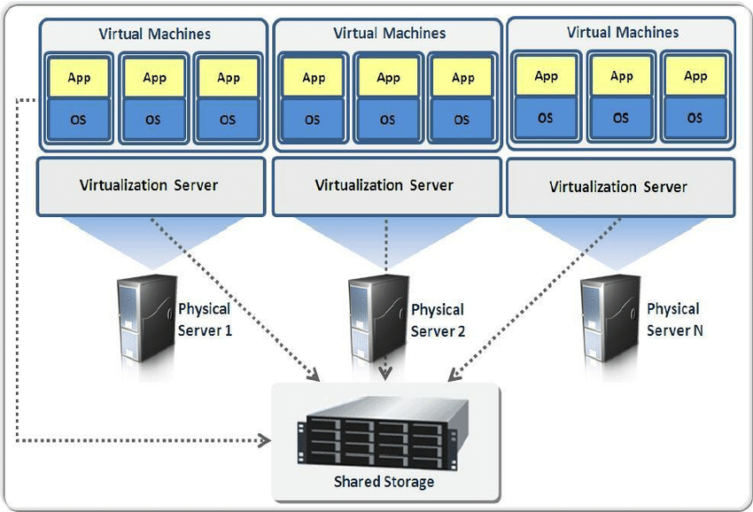

# Part 1: virtualization and Cloud Computing

**ISAE-SUPAERO, SDD, 26th November 2019**

Florient CHOUTEAU, Dennis WILSON

<!--v-->

### Outline

- **Presentation** (1h)
    - Intro to virtualization
    - The Cloud
    - Google Cloud Platform
- **Self-Paced Workshop** (2h)
- **QCM/Evaluation** (15 minutes)

<!--v-->

### This class and its workshop will be successful if you...

- ...have a rough idea of what is "cloud computing" <!-- .element: class="fragment" data-fragment-index="1" -->
- ...have a rough idea of what is "google cloud platform" <!-- .element: class="fragment" data-fragment-index="2" -->
- ...know how to create a instance and connect to it via SSH <!-- .element: class="fragment" data-fragment-index="3" -->
- ...have interacted with google cloud storage <!-- .element: class="fragment" data-fragment-index="4" -->
- ...know that IAC means Infrastructure as Code <!-- .element: class="fragment" data-fragment-index="5" -->

<!--v-->


<!--s-->

### Virtualization

<!--v-->

> In computing, virtualization refers to the act of creating a virtual (rather than actual) version of something, including virtual computer hardware platforms, storage devices, and computer network resources. 

Wikipedia

<!--v-->



<!--v-->

### Vocabulary

- Hypervisor (VMWare, Virtualbox,  [KVM](https://en.wikipedia.org/wiki/Kernel-based_Virtual_Machine)): A hypervisor is a program for creating and running virtual machines.
- Virtual Machine: A virtual machine is the emulated equivalent of a computer system that runs on top of another system
- Containers: Isolated environments that share the same underlying OS (**more this afternoon**)

<!--v-->

### Evolution of Virtualization


<!--v-->


<!--v-->


>  Any sufficiently advanced technology is indistinguishable from magic. 

Clarke Third Law

<!--v-->

### Hardware abstraction

- Hardware Abstraction ("download more RAM")
- Fine-grained resource allocation / sharing
- Decouple maintenance of hardware from maintenance of software

<!--v-->

### Availability, security

 <!-- .element height="40%" width="40%" background:none; -->

<!--v-->

### Why are we talking about this ?

 

<!--s-->

## Cloud Computing

<!--v-->

### In short...

- Externalization of computing resources
- Short-lease (or long-lease...) lending 
- In scalable quantities

<!--v-->

### In short...

- Use infra without owning it
- Pay-per-use
- Usually using code to manage it (**infrastructure as code**)

<!--v-->


... an origin story

<!--v-->

The year is 2002 and Amazon is encountering scaling issues...


<!--v-->

Amazon got good at building scalable infrastructure...

- For themselves
- But also for other partners (target)

And that infrastructure is often there to answer peak load...

<!--v-->

2002-2003; The idea

> Building an infrastructure that is completely standardized, completely automated, and relied extensively on web services for things like storage

http://blog.b3k.us/2009/01/25/ec2-origins.html

<!--v-->

Let's sell it !


<!--v-->

In 2018


<!--v-->

How can Amazon spend this much on free shipping ?


<!--v-->

### Cloud Computing: A technical *evolution*

- More Virtualization
- More API
- More Managed Services

<!--v-->

### Cloud Computing: A usage **revolution**

- Outsourcing maintenance, security, development of new services
- Infinitely scalable infrastructure
- No need to plan out infrastructure
    - Enabling innovation
    - Power in the hands of developpers/builders

<!--v-->

### Cloud Computing: A usage **revolution**

- We interact with cloud providers using API...

```bash
gcloud compute --project=deeplearningsps instances create ${INSTANCE_NAME} \
    --zone=${ZONE} \
    --machine-type=n1-standard-8 \
    --scopes=default,storage-rw,compute-rw \
    --maintenance-policy=TERMINATE \
    --image-family=ubuntu-1804-lts \
    --image-project=ubuntu-os-cloud \
    --boot-disk-size=200GB \
    --boot-disk-type=pd-standard \
    --accelerator=type=nvidia-tesla-p100,count=1 \
    --metadata-from-file startup-script=startup_script.sh
```

<!--v-->

### Before


<!--v-->

### After

```yaml
resources:
- name: vm-created-by-deployment-manager
  type: compute.v1.instance
  properties:
    zone: us-central1-a
    machineType: zones/us-central1-a/machineTypes/n1-standard-1
    disks:
    - deviceName: boot
      type: PERSISTENT
      boot: true
      autoDelete: true
      initializeParams:
        sourceImage: projects/debian-cloud/global/images/family/debian-9
    networkInterfaces:
    - network: global/networks/default
```

<!--v-->

### Infrastructure as Code

- Infra is now managed via text files
- Data is securely stored on storage
- So we store code + urls on git... and everything is reproducible !
- We use automated deployment tools (terraform, gcp deployment manager...) 

<!--v-->

### Pet vs Cattle


<!--v-->

### IaaS, PaaS, SaaS


<!--v-->

### PaaS


<!--v-->

### Hybrid, Private, Public


<!--v-->

### Who ?


<!--v-->

### You are using the cloud every day !

- Apple: 350m$ on AWS / year
- Spotify: 150m$ on GCP / year
- Lyft: 100m$ on AWS / year  


<!--v-->

### Anecdotes


https://cloud.google.com/blog/products/gcp/bringing-pokemon-go-to-life-on-google-cloud

<!--v-->

### More Anectores

http://highscalability.com

http://highscalability.com/all-time-favorites

Mind boggling statistics: https://aws.amazon.com/blogs/aws/amazon-prime-day-2019-powered-by-aws/

<!--s-->

  <!-- .element background=none; -->

<!--v-->

### GCP in brief

- One of the main cloud provider
- Behind AWS in SaaS (serverless...)
- More "readable" product line (for a Cloud Provider...)
- Very good "virtual machine" management (per second billing, fine-grained resource allocation)

<!--v-->


<!--v-->


<!--v-->

### Concepts: Zones and Regions


<!--v-->

### Concepts: Projects


- Access (Enabling API/Services)
- Ressources (Quota by project)
- Networking
- Billing

<!--v-->

### Concepts: Identity and Access Management


<!--v-->

### Main Products we are going to be looking at

- Google Compute Engine (virtual machine solutions)
- Google Cloud Storage (storage solutions)

<!--v-->

### GCE Basics:

- The VM solution for GCP
- Images: Boot disks for VM instances
    example:  `ubuntu-1804`
- Machine Types: Ressources available to your instance
    example: `n1-standard-8` (8 vCPU, 30 Gb RAM)
- Storage Options: "Attached disk" that can persist once the instance is destroyed... can be HDD, SDD...
- Preemptible: "Spot instances" on AWS", cheap but can be killed any minute by GCP

<!--v-->

### GCS Basics:

- Cheaper storage than persistent disks
- Can be shared between multiple instances / zones
- Higher latency
- Several types of storage (w/ different r/w costs & performance)
- Data is stored in "buckets" **whose name are globally unique**


<!--v-->

### Interacting with GCP:

- Using the gcloud CLI: https://cloud.google.com/sdk/install
- Using Google Cloud Shell: A small VM instance you can connect to with your browser

<!--s-->

## Self-paced Workshop

<!--v-->

### Objectives

- Configure your GCP credentials / account
- Launch your firsts VMs
- Connect to them via SSH & discover tmux


<!--v-->

### Demo

- Google Compute Engine Interface
- Google Cloud Shell

<!--v-->

### Network shennanigans

- If you are on **Eduroam** use either your terminal or Google Cloud Shell
- If you are on **ISAE-EDU** use Google Cloud Shell
- If you are on **4G** use either your terminal or Google Cloud Shell

<!--v-->

- If you are on **Windows** it is recommended that you use cloud shell except if you have *WSL* (linux for windows) or *putty* installed
- If you want to do everything from your computer you have to install the gcloud sdk https://cloud.google.com/sdk/install

<!--v-->

### SSH (Secure Shell)


<!--v-->

### TMUX (Terminal Multiplexing)

 <!-- .element height="40%" width="40%" background:none; -->

- A terminal multiplexer
- Detachable sessions

<!--v-->

[Your turn !](https://github.com/fchouteau/isae-practical-gcp/tree/master/1-intro-to-cloud)

<!--v-->

### QCM time !

http://kahoot.it

GAME PIN: 
