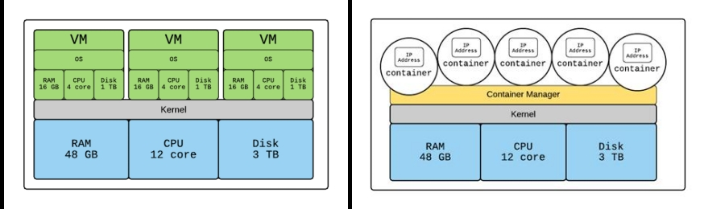

# Part 2: Docker and Containerization

**ISAE-SUPAERO, SDD, November 26th, 2019**

Florient CHOUTEAU, Dennis WILSON

<!--v-->

### Outline

- **Presentation** (<1h)
    - Intro to Docker
    - Using docker w/ GCP
    - Play With Docker
- **Self-paced Workshop** (3h)
- **QCM/Evaluation** (15 minutes)

<!--v-->

### This class will be successful if you understand...

- why we need a tool like docker 
- the basics of docker (containers, images) <!-- .element: class="fragment" data-fragment-index="1" -->
- the basics of a container registry <!-- .element: class="fragment" data-fragment-index="2" -->
- how to pull an image and run a container <!-- .element: class="fragment" data-fragment-index="3" -->
- what a Dockerfile looks like <!-- .element: class="fragment" data-fragment-index="4" -->

<!--v-->

### As a bonus, you will...

- discover using gcp tools for docker <!-- .element: class="fragment" data-fragment-index="1" -->
- package your first production ready Deep Learning model  <!-- .element: class="fragment" data-fragment-index="2" -->
- deploy it on Google Cloud Run and we will try to scale it   <!-- .element: class="fragment" data-fragment-index="3" -->

<!--s-->

## The need for Containers in software


<!--v-->

### IT Multimodality


<!--v-->

### The Matrix From Hell


<!--v-->

### Analogy...


<!--v-->

### Solution ?


<!--v-->

### Solution !


<!--v-->


Docker is a solution that **standardizes** packaging and execution of software in isolated environments (**containers**) that can communicate

> Build, Share, and Run Any App, Anywhere

<!--v-->

- Created in 2013
- Open Source
- Not a new idea but set a new standard

<!--v-->


<!--v-->


<!--v-->


<!--s-->

## Containers for Data Science ?

<!--v-->

### Multiple People


<!--v-->

### Complex Workflow

 <!-- .element: height="60%" width="60%" -->

<!--v-->

### Data Science is about reproducibility

- Communicating results
- Experimental science
- Hands-out

<!--v-->

### So... containers ?

- ... for deploying your models
- ... for standardized development environments
- ... for complex / large scale workflows

**it works on my notebook !**

<!--v-->

[Netflix and notebook scheduling](https://medium.com/netflix-techblog/scheduling-notebooks-348e6c14cfd6)


<!--v-->

https://www.kubeflow.org/


<!--s-->

## Docker "in-depth"

<!--v-->

### Drawbacks of VMs

- VM Contains full OS at each install => Install + Resource overhead
- VM needs pre-allocation of resource for each VM (=> Waste if not used)
- Communication between VM <=> Communication between computers

<!--v-->

### Container vs Virtual Machine


<!--v-->

### Container vs Virtual Machine, an Analogy


<!--v-->

### Resources allocation in containers

- Due to sharing underlying OS, the container manager can allocate resources (CPU, Storage, RAM) on the fly (!= VM)
- GPU is way easier to manage / share with containers



<!--v-->

### Some drawbacks of containers

- Most containers solution are based on Linux (Docker makes Windows container possible though)
- Isolation is not perfect since containers share underlying kernels (security and stability)

<!--v-->

### Vocabulary of Docker

- **Layer**: Set of read-only files to provision the system
- **Image**: Read-Only layer "snapshot" of an environment. Can inherit from another **Image**
- **Container**: Read-Write instance of an **Image**
- **DockerFile**: Description of the process used to build an Image
- **Hub**: Repository of Docker Images

<!--v-->


<!--v--> 

### Layers, Container, Image ?


<!--v-->

### Image vs Container

Docker:
```Dockerfile
FROM python:3.6
RUN pip install torch
CMD ipython
```

```bash
docker build -f Dockerfile -t my-image:1.0 .
docker run my-image
```

Python:
```python
class BaseImage:
    def __init__(self, a):
       self.a = a

class NewImage(BaseImage):
    def __init__(self, a, b):
       super(NewImage, self).__init__(a=a)
       self.b = b

container = NewImage(a=0,b=1)
```

<!--v-->

### Dockerfile

```Dockerfile
FROM python:3.7
ENV MYVAR="HELLO"
RUN pip install torch
COPY my-conf.txt /app/my-conf.txt
ADD my-file.txt /app/my-file.txt
EXPOSE 9000
WORKDIR "/WORKDIR"
USER MYUSER
ENTRYPOINT ["/BIN/BASH"]
CMD ["ECHO” , "${MYVAR}"] 
```

```bash
docker build -f Dockerfile -t my-image:1.0 .
docker run my-image
```

- Reproducible (if you include static data)
- Can be put under version control (simple text file)

<!--v-->

### Architecture


<!--v-->

### Registry

- Local registry: All images/containers in your machine
- https://hub.docker.com/
- GCP Container Registry
- Social Dimension (share docker images to speed up development/deployment)

<!--v-->

### In practice


<!--s-->

## A bit about the ecosystem

<!--v-->

### Docker Compose

- Multi-containers application with networking


<!--v-->

### Docker Compose

```yaml
version: '3'

services:
  app:
    build: .
    image: takacsmark/flask-redis:1.0
    environment:
      - FLASK_ENV=development
    ports:
      - 5000:5000

  redis:
    image: redis:4.0.11-alpine
```

<!--v-->

### Scheduling & Orchestration


<!--v-->

- Docker Swarm
- [Apache Mesos](https://mesos.apache.org/) / [Marathon](https://github.com/mesosphere/marathon)

... and the elephant in the room  <!-- .element: class="fragment" data-fragment-index="1" -->

**Kubernetes (k8s)**   <!-- .element: class="fragment" data-fragment-index="2" -->
<!--v-->

### [Kubernetes](https://kubernetes.io/docs/concepts/overview/what-is-kubernetes/)

- Intelligent and balanced scheduling of containers
- Creation, deletion, and movement of containers
- Easy scaling of containers
- Monitoring and self-healing abilities

<!--v-->


<--v-->

[Kubernetes comic !](https://cloud.google.com/kubernetes-engine/kubernetes-comic/)

<!--v-->

... and so many more !


<!--s-->

## Docker and GCP

<!--v-->

### GCP & Docker

- The per-project dockerhub is called [Container Registry](https://cloud.google.com/container-registry/) 
- Your images look like this `eu.gcr.io/project-id/a/b/c:1.0`
- You can use [Google Cloud Build](https://cloud.google.com/cloud-build/) to build dockerfiles remotely `gcloud builds submit --tag gcr.io/[PROJECT_ID]/quickstart-image .`
- To use gcloud with docker: `gcloud auth configure-docker`

<!--v-->

### GCP & Docker

- Everything is container-based (virtualization...)
- You can even deploy "virtual machines" with containers directly

... Where's the boundary ?

<!--s-->

## Self-Paced Workshop

<!--v-->

### Demo time

<!--v-->

### play-with-docker

- You need to have a docker hub account : https://hub.docker.com/
- https://labs.play-with-docker.com/
- Free, interactive, cluster of vms to experiment docker with
- https://training.play-with-docker.com/ lots of resoures !

<!--v-->

[Go here](https://github.com/fchouteau/isae-practical-gcp/tree/master/2-docker)

[If you have finished go here](https://github.com/fchouteau/isae-practical-gcp/tree/master/3-deploy-model-into-production)

<!--s-->

## Cheatsheets

<!--v-->


<!--v-->

### Dockerfile : Description d'une image

```Dockerfile
FROM python:3.7
ENV MYVAR="HELLO"
RUN pip install torch
COPY my-conf.txt /app/my-conf.txt
ADD my-file.txt /app/my-file.txt
EXPOSE 9000
WORKDIR "/WORKDIR"
USER MYUSER
ENTRYPOINT ["/BIN/BASH"]
CMD ["ECHO” , "${MYVAR}"] 
```

```bash
docker build -f Dockerfile -t my-image:1.0 .
docker run my-image
```

<!--v-->

### Images

        "docker search" sur un registry
            public (DokerHub)
            privé (entreprise)
        "docker build" à partir d'un Dockerfile
        "docker commit" sur un conteneur modifié
        "docker import" d'une arbo de base :
        
        cat centos6-base.tar | docker import - centos6-base


<!--v-->

### Containers

    docker create   : crée un conteneur
    docker run      : crée et démarre un conteneur
    docker stop     : arrête un conteneur
    docker start    : démarre un conteneur
    docker restart  : redémarre un conteneur
    docker rm       : supprime un conteneur
    docker kill     : envoie un SIGKILL au conteneur
    docker attach   : se connecte à un conteneur en exécution 
    docker exec     : exécute une cmd dans un conteneur

<!--v-->

### Containers


    -d, --detach       Run container in background and print ID
    -e, --env=[]       Set environment variables
    -i, --interactive  Keep STDIN open even if not attached
    -p, --publish=[]   Publish a container's port(s) to the host
    --rm               Automatically rm container when it exits
    -t, --tty          Allocate a pseudo-TTY
    -v, --volume=[]    Bind mount a volume
    -w, --workdir      Working directory inside the container

<!--s-->

## Docker Key Points

<!--v-->

### What we have learned

- Containerisation is the step beyond virtualization
- Containers are used to package software in a standardized way
- Docker Images share underlying OS & can share dependencies
- Unlike VM, you don't pre-allocate resources with containers (due to kernel sharing)
- Images are 'Classes', Containers are 'Objects'
- Docker Hubs enable collaboration

<!--v-->

## What we haven't touched

- Containers really shine when you are deploying multi-containers applications
    - [This tutorial on microservices w/ Compose](https://training.play-with-docker.com/microservice-orchestration/)
- Containers really shine when you are in a cluster world
    - [Docker swarm](https://training.play-with-docker.com/swarm-stack-intro/)
- Orchestration & Scheduling
    - [Read this excellent Kubernetes comic !](https://cloud.google.com/kubernetes-engine/kubernetes-comic/)
