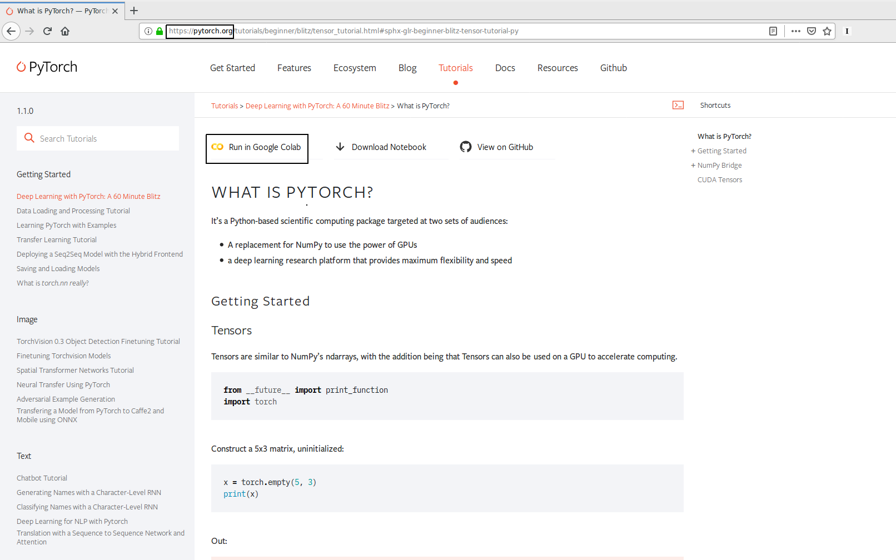

# Part 3: Google Cloud Platform for Data Scientists

**ISAE-SUPAERO, SDD, 27th November 2019**

Florient CHOUTEAU, Dennis WILSON

<!--v-->

### During this class we will...

- ...Discover useful managed services for data science  <!-- .element: class="fragment" data-fragment-index="1" -->
- ...Run some jupyter notebooks in the cloud  <!-- .element: class="fragment" data-fragment-index="2" -->
- ...Without SSH ! (hidden)  <!-- .element: class="fragment" data-fragment-index="3" -->
- ...Without Docker ! (hidden)  <!-- .element: class="fragment" data-fragment-index="4" -->

<!--v-->

### Outline

**Presentation ( < 1h)**

- Overview of useful GCP services 
- Intro to Jupyter AI Notebook
- Jupyter Notebook remote execution
- Intro to Google Colaboratory

<!--v-->

### Outline

**TP (remaining time)**

- My first production model deployed in Google Cloud Run ! (continued.)
- Starting a Jupyter AI Notebook and connecting to it (w/o ssh)
- Bonus: Using Colaboratory
- Bonus: Scheduling a notebook on a Deep Learning VM (intro to scheduled computing)

<!--s-->

## Google Cloud Platform 4 Data Science

<!--v-->

### Day to day usage

- Data Stored in GCS
- Remote development on a GCE
- Distributed Training / HP Tuning using clusters
- Infrastructure as Code to instantiate clusters
- Deployment using docker containers

<!--v-->

### Going further (a bit too far ?)

[source](https://medium.com/netflix-techblog/notebook-innovation-591ee3221233)

<!--v-->

### Most useful "IaaS/PaaS" products

- Cloud Storage: Out-of-disk storage
- Compute Engine: Virtual Machines
- Container Registry: Sharing Docker images with your teams
- Kubernetes Engine: Managed Kubernetes if you are doing clusters

<!--v-->

### Some Managed Products

- All the storage / databases solutions + [BigQuery](https://cloud.google.com/bigquery/docs/)
- [Datalab](https://cloud.google.com/datalab/docs/): Managed Jupyter notebook
- [Dataproc](https://cloud.google.com/dataproc/docs/): Managed Spark Cluster 
- [AutoML](https://cloud.google.com/automl/): Managed Neural Architecture Search

(...and so many more)

<!--v-->

### AI (Deep Learning) Hub Products

https://aihub.cloud.google.com/

- [Deep Learning VM](https://cloud.google.com/deep-learning-vm/docs/): Preconfigured Compute Engine for Deep Learning
- [AI Platform Notebook](https://cloud.google.com/ml-engine/docs/notebooks/): Managed JupyterLab notebook instances

(...and so many more)

<!--v-->

Let's talk about one or two...

<!--s-->

## AI Platform Notebooks

<!--v-->

## Features

- Google Compute Engine
- Preconfigured for ML / DL
- With Jupyterlab pre-launched

<!--v-->

2 different workflows

- Jupyter only ("AI Notebook")

- Pre-configured instance for Data Science ("Deep Learning VM")

<!--v-->

Advanced Usage (not covered here)

- Extensive tutorial
- Use "preemptible" (spot in AWS terminology)*
- CLI creation for more customization

*5x less expensive, run only 24h

<!--v-->

### Main Features of AI Notebooks

- Preconfigured, Preinstalled data science instances
- GPU Option
- **Jupyterlab accessible without ssh !** 

... We will use them extensively later ;) <!-- .element: class="fragment" data-fragment-index="2" -->

<!--v-->

### What is the difference with DLVMs ?

- Same underlying technology
- Not same creation method => AI Notebook expose jupyter lab through https
- Otherwise it's the same !

<!--v-->

### Demo of AI Notebook (Jupyterlab)

- Use a Jupyter AI Notebook Instance as a Dev Environment

<!--v-->

### Demo of Notebook Scheduling

- Create a Jupyter AI Notebook Instance to run a local notebook then close it

<!--s-->

## Google Colaboratory

https://colab.research.google.com

<!--v-->

<!--v-->

### What is Google Colab ?

- The "free version" of Jupyter AI Notebook

- Jupyter Notebook + Google Drive

- Full python data science environment

- 24h max session lifetime

<!--v-->

### Is it for YOU ? 

**Yes !**

Reproducible jupyter <!-- .element: class="fragment" data-fragment-index="1" -->

Shareable jupyters that runs <!-- .element: class="fragment" data-fragment-index="2" -->

<!--v-->

### Nice features

- You just need a google account

- Can use your data: gdrive, gsheet, local filesystem

- Jupyter-based: All the power of interactive & visualisations

- You can `apt-get` and `pip install` what you need

<!--v-->

### Nicer features

- GPU (P100 !) ! (Nvidia Tesla T4, 16 GB GPU RAM = 3000$)

- Collaboration ! (share and co-edit notebooks)

- Open notebook from github to colab ! 

<!--v-->

### Limitations

- Long calculations w/ guarantees (you can checkpoint your models on colab though)

- Code syncing / huge codebase & huge datasets

- Full control over installation and data

<!--v-->

### Colab is free... the other is paid... why not only use colab ?

 <table style="width:100%">
  <tr>
    <th>Google Colab</th>
    <th>Google AI Notebook</th>
  </tr>
  <tr>
    <td>Learn, experiment </td>
    <td>Can scale compute</td>
  </tr>
  <tr>
    <td>Single notebook / Clone from github</td>
    <td>Upload own code</td>
  </tr>
  <tr>
    <td>Simple jupyter env.</td>
    <td>Full jupyter lab or SSH access</td>
  </tr>
  <tr>
    <td>Data from anywhere / google drive</td>
    <td>Fully owned cloud environment</td>
  </tr>
  <tr>
    <td>Short runtimes</td>
    <td>Cheap 1d runtimes or arbitrary runtimes</td>
  </tr>
  <tr>
    <td>**free**</td>
    <td>**[paid](https://cloud.google.com/compute/pricing)** (by minute of computing + storage)</td>
  </tr>
</table> 

<!--v-->

Demo !

<!--s-->

## Self-Paced Workshop

<!--v-->

<!--v-->

### Workshop time

[Instructions](https://github.com/fchouteau/isae-practical-gcp/tree/master/4-gcp-for-data-science)
